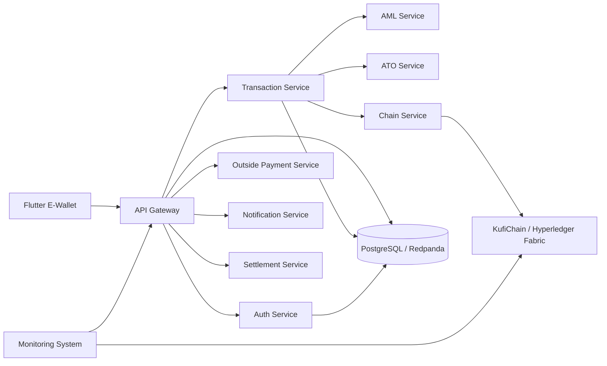

# Kufi — Consortium E-Wallet & Blockchain Platform

A full-stack digital wallet platform backed by a **Hyperledger Fabric consortium network**, with microservices, a Flutter client, AML/ATO services, operational monitoring, and performance evaluation tooling.

> Capstone engineering project focused on distributed systems, blockchain infrastructure, backend architecture, and financial-service observability.

## Overview

Kufi combines a conventional e-wallet architecture with a permissioned blockchain layer for consortium-based transaction processing and governance.

The repository is organized as a multi-system project:

- **E-Wallet Platform** — NestJS microservices, Flutter frontend, PostgreSQL, Redpanda, AML and ATO services.
- **KufiChain** — Go CLI and runtime for provisioning and operating Hyperledger Fabric orderer/peer nodes.
- **Monitoring System** — operational dashboard with authentication, RBAC, audit logs, and metrics aggregation.
- **Evaluation Toolkit** — load-testing and benchmark utilities for system evaluation.

## Architecture



## Key Engineering Areas

### Wallet microservices

The wallet backend is split into dedicated services for authentication, transactions, external payments, blockchain interaction, notifications, and settlement.

### Permissioned blockchain

`KufiChain` provides a CLI-driven workflow for setting up and operating Hyperledger Fabric orderer and peer nodes in a consortium network. It supports interactive setup, peer joining, node lifecycle operations, and chaincode deployment workflows.

### Risk services

Python-based **AML** and **ATO** services are integrated into the wallet platform for transaction and account-risk processing.

### Observability

The monitoring system includes a NestJS backend and React/Vite console with authentication, RBAC, audit logs, and metrics aggregation.

### Performance evaluation

The evaluation module contains load-testing utilities and benchmark result sets for measuring system behavior under workload.

## Tech Stack

| Layer | Technologies |
|---|---|
| Mobile | Flutter, Dart |
| Backend | NestJS, Node.js, TypeScript |
| Risk Services | Python |
| Blockchain | Hyperledger Fabric, Go |
| Data & Messaging | PostgreSQL, Redpanda |
| Monitoring | NestJS, React, Vite |
| Infrastructure | Docker, Docker Compose |
| CI/CD | GitHub Actions |

## Repository Structure

```text
.
├── e-wallet/              # Wallet backend microservices + Flutter app + AML/ATO
├── chain/                 # KufiChain CLI + Hyperledger Fabric integration
├── monitoring_system/     # Monitoring API and web console
├── evaluation/            # Load testing and benchmark tooling
├── ref/                   # Research/reference papers
└── .github/               # CI/CD workflows
```

## Documentation

Each subsystem has its own documentation:

- [`e-wallet/README.md`](e-wallet/README.md) — wallet infrastructure, backend services, Python services, and Flutter client.
- [`chain/README.md`](chain/README.md) — KufiChain setup, build, node provisioning, CLI commands, and deployment flow.
- [`monitoring_system/README.md`](monitoring_system/README.md) — monitoring backend/web stack and local deployment.
- [`evaluation/README.md`](evaluation/README.md) — evaluation toolkit and benchmark results.

## Prerequisites

For the complete development environment:

- Docker Engine 24+ and Docker Compose v2
- Node.js 20+ and npm 10+
- Python 3.10+ with `venv` and `pip`
- Flutter stable with Dart 3.10+
- Android SDK for APK builds
- Go 1.21+

Individual modules may require only a subset of these dependencies. See the subsystem documentation above for exact setup instructions.

## Quick Start

### Wallet infrastructure

```bash
cd e-wallet
docker compose -f docker-compose.infra.yml up -d
```

Then follow [`e-wallet/README.md`](e-wallet/README.md) to start individual backend services and the Flutter client.

### KufiChain CLI

```bash
cd chain
chmod +x install-prereq.sh
./install-prereq.sh
go build -o kufichain ./cmd/kufichain
./kufichain setup --data-dir .orderer
```

See [`chain/README.md`](chain/README.md) for orderer/peer workflows and the full CLI reference.

### Monitoring stack

```bash
cd monitoring_system
docker compose up -d
```

## Build the Flutter APK

From `e-wallet/frontend`:

```bash
flutter pub get
flutter build apk --release \
  --dart-define=API_BASE_URL=http://<api-host>:3000 \
  --dart-define=FIREBASE_API_KEY=<your-firebase-api-key>
```

Output:

```text
build/app/outputs/flutter-apk/app-release.apk
```

For Windows PowerShell and desktop targets, see [`e-wallet/README.md`](e-wallet/README.md).

## Contributors

- **Lê Đỗ Minh Anh** — 2252023
- **Trần Đăng Khoa** — 2252363

---

Built as a capstone project exploring how modern wallet services, permissioned blockchain infrastructure, operational monitoring, and risk-processing components can be composed into one distributed platform.
